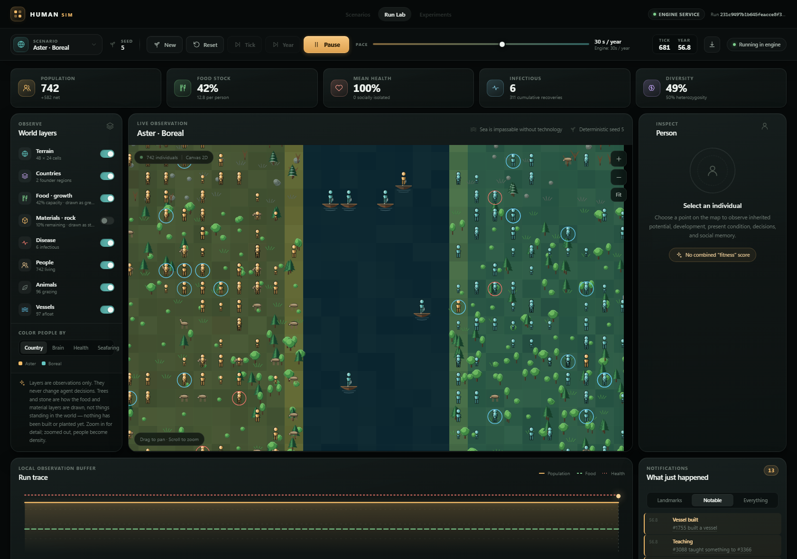
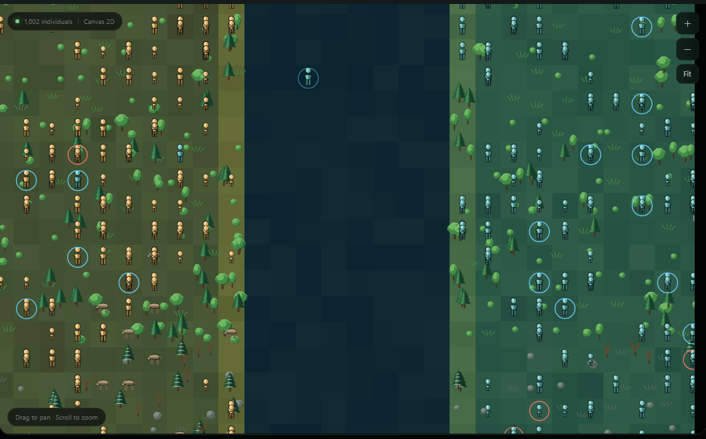

# Human-Sim

**A deterministic agent-based simulation for watching population-level
behaviour appear on its own.**

[](https://github.com/ShubhendraGautam/human-sim/actions/workflows/ci.yml)

Nothing here is scripted — no stories, no institutions, no historical events.
The engine defines a small substrate (space, finite food, metabolism, local
perception, action costs, reproduction, inheritance, mutation) and everything
above that has to emerge from repeated local interaction, or not happen at all.



---

## Quick start

```bash
./run.sh setup     # create .venv, install Python and UI dependencies
./run.sh start     # engine API on :8000, Run Lab UI on :5173
```

Open <http://127.0.0.1:5173> and press **Run**.

No UI needed for a one-off experiment — the core has zero runtime
dependencies:

```bash
python3 -m sims.simple_sim --population 1000 --ticks 240 --seed 42
```

---

## What you are looking at



Two founder countries either side of a strait. Colour is data, not decoration:
gold and teal are birth countries, cyan rings are people who hold a vessel,
red rings are the infectious. The brown quadrupeds are animals — grazing on
the same food layer people harvest, so a herd is both competition and food.
Trees and stone are how the food and material layers are drawn, not objects
standing in the world: nothing has been built or planted yet.

Everything the interface shows is a reading of engine state. Browser controls
can move time and set starting conditions; they cannot touch a decision.

---

## What emerges

| Mechanism | What it does |
|---|---|
| **Genetics** | 64-locus diploid genomes, recombination, mutation, and inherited potential kept strictly separate from acquired condition |
| **Minds** | Four brain mechanisms over a small network that senses the world, not just its own body — with lifetime plasticity present and off by default, because it measured *worse* than not learning |
| **Language** | Populations start mute. Words are coined from nothing, grounded in what both parties can see, and children acquire them from whoever feeds them. Dialects are the expected outcome where contact is thin |
| **Technology** | An open table of learnable techniques rather than named skills — discovery and teaching are written against no technique in particular |
| **Seafaring** | Coastal experimentation, materials, and hulls that are spent by time at sea, so a failed voyage drowns whoever is aboard |
| **Disease** | Local SEIR with an environmental reservoir, where density decides whether an introduction fizzles or becomes a wave |
| **Society** | Bounded asymmetric memories of trust and reciprocity, pair bonds, dependent children, and caregiver food transfer |

The full mechanism list, with the limits on each, is in
[docs/model.md](docs/model.md).

Religion is a transmissible identity label, not scripted behaviour. Wealth,
markets, borders, and government are deliberately absent until lower-level
mechanics can produce them.

---

## Does the mechanism change anything?

A mechanism that cannot be shown to change an outcome is not a feature. The
comparison harness runs arms across the same seeds and refuses to dress up a
difference that seed-to-seed noise could explain:

```bash
./run.sh experiment \
  --arm on --arm off=neural_output_weight=0 \
  --config configs/pressure.json --seeds 0,1,2,3,4,5 --years 300
```

This is how lifetime plasticity ended up off by default — it measured *worse*
than not learning, and how the neural brain was found to be a **handicap for
the first few dozen generations and a 21% advantage after that**
([docs/findings.md](docs/findings.md)). Two things make or break such a
comparison, both handled for you and both explained in
[docs/cli.md](docs/cli.md): arms must
start from an identical world (some settings silently break that), and with
`n` paired seeds the best possible sign-test p-value is `2/2ⁿ`, so six seeds
is the floor at p ≤ 0.05 however large the effect.

Choose the world with care. Under `configs/baseline.json` nothing is scarce
and every arm survives; under `configs/scarcity.json` every arm goes extinct
by about year 150. `configs/pressure.json` is the band in between, where a
population persists *and* is squeezed — the only place a mechanism that helps
people eat can show up as more people.

---

## Runs that outlive the terminal

`sims.simple_sim` runs a world *inside* the command that starts it. For a
world meant to be left going for days and checked on now and then, the engine
service holds the run and advances it on its own clock — no browser, no
terminal, nothing attached:

```bash
./run.sh start --api-only
./run.sh lab start --scenario scenarios/two_islands.json --seed 5 --pace fast
#   run       c12fb6dceded4500b43c907ba4bf8035
#   observe   http://127.0.0.1:5173/?run=c12fb6dceded4500b43c907ba4bf8035

./run.sh lab list                   # what the service is holding
./run.sh lab watch <id> --every 60  # a metrics line a minute; Ctrl-C is safe
./run.sh lab pause <id>
```

`--pace` is how much real time one simulated year should take: `fast`, or a
number with an `s`/`m`/`h`/`d` suffix. Opening the Run Lab *attaches* to a run
rather than starting one, so a reload continues where you were and closing the
tab leaves the world going.

⚠️ **Runs live in memory.** Stopping the API — `./run.sh stop`, a crash, a
reboot — ends every run it held, and there is no way to load one back.
`./run.sh stop --ui-only` is the safe half. Snapshots are an export for
analysis, not a resumable save.

Every command, including the headless recipes and the scaling and profiling
harnesses, is in [docs/cli.md](docs/cli.md).

---

## Architecture

```text
SimulationConfig (immutable rules)
          |
          v
Simulation engine -----> aggregate metrics / bounded event log
    |          |
    v          v
  World     EntityRegistry            versioned service boundary
resource    one id space        ----> HTTP API ----> Run Lab UI (React)
grid        people, fauna, ...        (projections only, never control)
  |              |
  +---> spatial index, one bucket per kind
```

The engine is headless and owns its clock and its random generator. Rendering
and analysis consume its projections and never steer it. A spatial index keeps
per-tick work growing with population and local perception area rather than
with the square of the population, and relationships live in a fixed-width
store instead of per-agent graphs.

- [docs/architecture.md](docs/architecture.md) — engine design and extension rules
- [docs/ui-architecture.md](docs/ui-architecture.md) — service contracts, who owns the clock, scaling
- [docs/biology-and-brains.md](docs/biology-and-brains.md) — what the biology model does and does not claim
- [docs/design-checklist.md](docs/design-checklist.md) — what lands next, and what each addition must prove

---

## Tests

```bash
./run.sh check          # lint, then both suites
python3 -m unittest discover -v
```

CI runs four jobs on every branch push and pull request: flake8 at 79 columns;
the suite on Python 3.10–3.14 with *nothing* installed, so the zero-dependency
promise is enforced rather than stated; the suite again with the optional API
dependencies, so the guarded tests cannot silently skip; and typecheck, test,
and build for the UI. Repeated pushes cancel an older in-progress run for the
same branch, so only the newest change consumes the full test run.

---

## Experimental discipline

Do not infer emergence from one visually interesting run. Compare repeated
seeds across increasing population sizes while holding density constant. A
candidate emergent behaviour should be measurable, repeatable as a
distribution, and absent or qualitatively different below some scale.

Experiment-facing parameters live in `SimulationConfig`; changing one creates
a new experimental condition. Record the complete configuration, seed, and
code revision with any result.

---

## License

MIT — see [LICENSE](LICENSE).
